<!--
  Profile README for: adarsh-gautam-sys
  Repo: github.com/adarsh-gautam-sys/adarsh-gautam-sys
  Widths 370/490 keep the portrait + info card the same height.
-->

<table>
<tr>
<td valign="top"></td>
<td valign="top"></td>
</tr>
</table>

## Adarsh Gautam

**Software Engineer · Cloud & Infra · Open Source**

 

<!-- animated contribution graph, refreshed daily by the workflow -->

